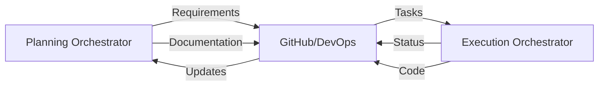

# 🧠 Copilot Orchestra — Dual Orchestrator System

## 🎯 Overview

The **Copilot Orchestra** consists of two distinct orchestrators that work together but remain separate:
- **Planning Orchestrator** - Manages requirements, documentation, and project planning
- **Execution Orchestrator** - Handles implementation, code generation, and deployment

Both orchestrators communicate via GitHub and Azure DevOps but maintain separate responsibilities and agent pools.

---

# 📋 Planning Orchestrator

## Purpose

The **Planning Orchestrator** is responsible for:
* Gathering and structuring requirements in Markdown
* Creating project plans and roadmaps
* Managing sprints and dependencies
* Synchronizing documentation with GitHub/Azure DevOps
* Maintaining the single source of truth in Markdown format

## Architecture

### Planning Agents

| Agent | Purpose | Output |
|-------|---------|--------|
| **PlanAgent** | Converts ideas and notes into structured project plans | `plans/*.md` |
| **RequirementsAgent** | Manages and structures requirements, detects duplicates | `requirements/*.md` |
| **SprintAgent** | Plans sprints, manages sprint cycles and retrospectives | `sprints/sprint-YYYY-MM.md` |
| **DocAgent** | Maintains documentation, changelogs, and release notes | `changelogs/*.md`, `docs/*.md` |
| **GitAgent** | Version control, commits, branches, tags | Git operations |
| **DevOpsAgent** | Creates User Stories, Features, Epics with acceptance criteria | Azure DevOps work items |
| **SyncAgent** | Bidirectional sync between GitHub ↔ Azure DevOps | Synchronized data |
| **DependencyAgent** | Analyzes dependencies and critical paths (DAG) | `dependencies.md` |

### Folder Structure

```
/PlanAgents/
│
├── agents/
│   ├── plan_agent.md
│   ├── requirements_agent.md
│   ├── sprint_agent.md
│   ├── doc_agent.md
│   ├── git_agent.md
│   ├── devops_agent.md
│   ├── sync_agent.md
│   └── dependency_agent.md
│
├── templates/
│   ├── requirement_template.md
│   ├── sprint_template.md
│   ├── feature_template.md
│   ├── epic_template.md
│   └── user_story_template.md
│
└── output/
    ├── requirements/
    ├── plans/
    ├── sprints/
    ├── roadmap/
    └── dependencies/
```

## Planning Workflow

1. **Requirement Gathering** → PlanAgent & RequirementsAgent
2. **Sprint Planning** → SprintAgent & DependencyAgent
3. **Documentation** → DocAgent
4. **Version Control** → GitAgent
5. **Work Item Creation** → DevOpsAgent
6. **Synchronization** → SyncAgent

---

# ⚡ Execution Orchestrator

## Purpose

The **Execution Orchestrator** is responsible for:
* Implementing code based on requirements from Planning
* Running tests and code reviews
* Managing deployments and releases
* Providing status updates back to Planning

## Architecture

### Implementation Agents

| Agent | Purpose | Output |
|-------|---------|--------|
| **Conductor** | Main orchestrator for execution tasks | Task coordination |
| **ImplementAgent** | Generates code based on requirements | Source code |
| **CodeReviewAgent** | Reviews code for quality and standards | Review reports |
| **TestAgent** | Runs tests and generates reports | Test results |
| **BuildAgent** | Manages build processes | Build artifacts |
| **DeployAgent** | Handles deployments to environments | Deployment logs |
| **StatusAgent** | Reports progress back to Planning | Status updates |

### Folder Structure

```
/ImplementationAgents/
│
├── agents/
│   ├── Conductor.agent.md
│   ├── implement-subagent.agent.md
│   ├── code-review-subagent.agent.md
│   ├── git-subagent.agent.md
│   ├── planning-subagent.agent.md
│   ├── test-subagent.agent.md
│   ├── build-subagent.agent.md
│   └── deploy-subagent.agent.md
│
├── plans/
│   └── [execution plans]
│
└── README.md
```

## Execution Workflow

1. **Receive Requirements** ← from Planning Orchestrator
2. **Task Assignment** → Conductor
3. **Implementation** → ImplementAgent
4. **Code Review** → CodeReviewAgent
5. **Testing** → TestAgent
6. **Building** → BuildAgent
7. **Deployment** → DeployAgent
8. **Status Update** → back to Planning

---

# 🔄 Inter-Orchestrator Communication

## Communication Channels

| Direction | Channel | Content |
|-----------|---------|---------|
| Planning → Execution | GitHub Issues/PRs | Requirements, tasks, priorities |
| Planning → Execution | Azure DevOps Work Items | User Stories, Features, Epics |
| Execution → Planning | GitHub Comments | Status updates, blockers |
| Execution → Planning | Azure DevOps Updates | Progress, completion status |
| Bidirectional | Git Commits | Documentation, code changes |

## Data Flow



## Synchronization Points

1. **Sprint Start** - Planning pushes sprint goals to Execution
2. **Daily Sync** - Status updates from Execution to Planning
3. **Sprint End** - Results and retrospective data exchange
4. **Release** - Documentation and changelog synchronization

---

# 📊 Task Structure

## Standard Task Format

Both orchestrators use the same task format for consistency:

```markdown
---
id: TSK-001
orchestrator: planning | execution
type: requirement | implementation | test | deployment
status: planned | in-progress | review | done | blocked
depends_on: [TSK-000]
assigned_to: [Agent Name]
priority: critical | high | medium | low
acceptance_criteria:
  - Criterion 1
  - Criterion 2
sprint: 2025-11
created_by: PlanningOrchestrator
executed_by: ExecutionOrchestrator
---

### Description
[Task details]

### Input
[What this task needs]

### Output
[What this task produces]
```

---

# 🚀 Implementation Roadmap

## Phase 1: Foundation
- [ ] Set up separate repositories/folders for each orchestrator
- [ ] Define communication protocols
- [ ] Create base templates

## Phase 2: Planning Orchestrator
- [ ] Implement core planning agents
- [ ] Set up GitHub/DevOps integration
- [ ] Create documentation workflows

## Phase 3: Execution Orchestrator
- [ ] Implement conductor and sub-agents
- [ ] Set up build/test pipelines
- [ ] Create deployment workflows

## Phase 4: Integration
- [ ] Establish bidirectional communication
- [ ] Implement status synchronization
- [ ] Test end-to-end workflows

## Phase 5: Optimization
- [ ] Add DAG analysis for dependencies
- [ ] Implement feedback loops
- [ ] Optimize agent performance

---

# 📝 Configuration Examples

## Planning Orchestrator Config
```yaml
# Example configuration structure
orchestrator:
  name: planning-orchestrator
  type: planning
  
github:
  repo: your-org/project-planning

azure_devops:
  organization: your-org
  project: your-project
  
agents:
  enabled:
    - plan_agent
    - requirements_agent
    - sprint_agent
    - doc_agent
    - git_agent
    - devops_agent
    - sync_agent
```

## Execution Orchestrator Config
```yaml
# Example configuration structure
orchestrator:
  name: execution-orchestrator
  type: execution
  
github:
  repo: your-org/project-code

communication:
  planning_repo: your-org/project-planning
  sync_interval: 3600 # seconds
  
agents:
  enabled:
    - conductor
    - implement_agent
    - code_review_agent
    - test_agent
    - build_agent
    - deploy_agent
```

---

# ✅ Summary

The **Copilot Orchestra** maintains clear separation between:

- **Planning Orchestrator** (`/PlanAgents/`) - Focuses on requirements, documentation, and project management
- **Execution Orchestrator** (`/ImplementationAgents/`) - Handles implementation, testing, and deployment

Both orchestrators:
- Communicate through GitHub and Azure DevOps
- Maintain their own agent pools and workflows
- Use consistent Markdown formats for interoperability
- Support bidirectional synchronization
- Can be deployed independently