# 🧠 Copilot Orchestra — Dual Orchestrator System

## 🎯 Overview

The **Copilot Orchestra** consists of two distinct orchestrators that work together but remain separate:
- **Planning Orchestrator** - Manages requirements, documentation, and project planning
- **Execution Orchestrator** - Handles implementation, code generation, and deployment
- **Human Developer** - Initiates all actions via GitHub Copilot Chat prompts

Both orchestrators are **prompt-driven** and communicate via GitHub and Azure DevOps while maintaining separate responsibilities and agent pools.

---

# 💬 Prompt-Driven Architecture

## Developer as Prompter

The developer initiates and controls everything through **GitHub Copilot Chat**:

```markdown
Examples of developer prompts:
- "Create a new feature for user authentication"
- "Plan the next sprint based on current backlog"
- "Generate implementation for TSK-001"
- "Review the code in the current PR"
- "Deploy to staging environment"
- "Show me the current sprint status"
```

## Prompt Flow

```mermaid
graph TB
    D[👤 Developer]
    C[GitHub Copilot Chat]
    P[Planning Orchestrator]
    E[Execution Orchestrator]
    G[GitHub/DevOps]
    
    D -->|Prompt| C
    C -->|Interprets| C
    C -->|Routes to| P
    C -->|Routes to| E
    
    P -->|Response| C
    E -->|Response| C
    C -->|Display| D
    
    D -->|Decision Prompt| C
    C -->|Execute| P
    C -->|Execute| E
    
    P -.->|Background Sync| G
    E -.->|Background Sync| G
```



---

# 👤 Human Interaction Points

## Copilot Chat Commands

| Command Type | Example Prompt | Orchestrator | Response |
|--------------|----------------|--------------|----------|
| **Planning** | `@planning create user story for login feature` | Planning | Generates user story, asks for approval |
| **Sprint** | `@planning start new sprint` | Planning | Shows proposed sprint, asks for confirmation |
| **Implement** | `@execution implement TSK-001` | Execution | Generates code, shows in chat |
| **Review** | `@execution review current changes` | Execution | Shows review comments |
| **Deploy** | `@execution deploy to staging` | Execution | Asks for confirmation, then deploys |
| **Status** | `@orchestra show sprint progress` | Both | Shows dashboard in chat |
| **Decision** | `approve` / `reject` / `modify` | Current context | Executes decision |

---

# 📋 Planning Orchestrator

## Purpose

The **Planning Orchestrator** responds to planning-related prompts:
* Converting prompts into structured requirements
* Creating project plans from chat conversations
* Managing sprints through chat commands
* Generating documentation from discussions
* Maintaining project state in Markdown

## Architecture

### Planning Agents

| Agent | Triggered By | Chat Response | Follow-up Prompts |
|-------|--------------|---------------|-------------------|
| **PlanAgent** | `create plan for [feature]` | Shows generated plan | `approve`, `modify`, `add details` |
| **RequirementsAgent** | `define requirements for [feature]` | Lists requirements | `add acceptance criteria`, `prioritize` |
| **SprintAgent** | `plan sprint`, `close sprint` | Sprint overview | `add task`, `remove task`, `start sprint` |
| **DocAgent** | `generate docs`, `update readme` | Shows documentation | `approve`, `edit section`, `regenerate` |
| **GitAgent** | Automatic on approval | Commit confirmation | N/A - automated |
| **DevOpsAgent** | `create work items` | Shows created items | `assign to [user]`, `set priority` |
| **SyncAgent** | Background process | Sync status | N/A - automated |
| **DependencyAgent** | `analyze dependencies` | Dependency graph | `resolve conflict`, `reorder tasks` |

### Folder Structure (Generated from prompts)

```
/planning/
│
├── agents/
│   ├── plan.agent.md
│   ├── requirements.agent.md
│   ├── sprint.agent.md
│   ├── doc.agent.md
│   ├── git.agent.md
│   ├── devops.agent.md
│   ├── sync.agent.md
│   └── dependency.agent.md
│
├── templates/           # Used by agents when responding to prompts
│   └── [templates]
│
└── output/             # Auto-generated from chat sessions
    ├── requirements/   # Created when developer prompts for requirements
    ├── plans/         # Created when developer prompts for plans
    ├── sprints/       # Created when developer starts sprints
    └── dependencies/  # Created when analyzing dependencies
```

## Planning Workflow via Prompts

1. **👤 Developer Prompt**: `@planning create feature X`
2. **Chat Response**: PlanAgent shows generated plan
3. **👤 Decision Prompt**: `approve with modifications: [changes]`
4. **Sprint Creation**: SprintAgent creates sprint
5. **👤 Confirmation**: `start sprint`
6. **Background**: GitAgent commits, SyncAgent syncs

---

# ⚡ Execution Orchestrator

## Purpose

The **Execution Orchestrator** responds to implementation-related prompts:
* Generating code from chat commands
* Running tests on demand
* Performing code reviews in chat
* Deploying through chat approval
* Showing build status in responses

## Architecture

### Implementation Agents

| Agent | Triggered By | Chat Response | Follow-up Prompts |
|-------|--------------|---------------|-------------------|
| **Conductor** | `@execution start task [id]` | Task breakdown | `proceed`, `modify approach` |
| **ImplementAgent** | `implement [feature]` | Shows generated code | `accept`, `regenerate`, `modify` |
| **ReviewAgent** | `review code` | Review comments | `fix issues`, `explain`, `ignore` |
| **TestAgent** | `run tests` | Test results | `fix failing`, `skip`, `rerun` |
| **BuildAgent** | `build project` | Build status | `view logs`, `retry` |
| **DeployAgent** | `deploy to [env]` | Deployment plan | `confirm`, `cancel`, `schedule` |
| **StatusAgent** | Background/on request | Progress updates | `show details`, `show blockers` |

### Folder Structure (Managed via prompts)

```
/execution/
│
├── agents/
│   ├── conductor.agent.md
│   ├── implement.agent.md
│   ├── review.agent.md
│   ├── test.agent.md
│   ├── build.agent.md
│   ├── deploy.agent.md
│   └── status.agent.md
│
├── workspace/          # Auto-managed based on prompts
│   └── [generated and reviewed code]
│
└── plans/             # Execution plans from chat sessions
```

## Execution Workflow via Prompts

1. **👤 Prompt**: `@execution implement login feature`
2. **Conductor Response**: Shows implementation approach
3. **👤 Decision**: `proceed with approach 2`
4. **Code Generation**: ImplementAgent shows code in chat
5. **👤 Review**: `looks good, add error handling`
6. **Modification**: Agent updates code
7. **👤 Approval**: `commit and create PR`
8. **Testing**: `run tests`
9. **👤 Fix**: `fix the failing test`
10. **👤 Deploy**: `deploy to staging`
11. **Confirmation**: `yes, deploy now`

---

# 🔄 Inter-Orchestrator Communication

## Prompt-Driven Data Flow

```mermaid
graph LR
    subgraph "GitHub Copilot Chat"
        D[👤 Developer Prompts]
        R[Orchestrator Responses]
    end
    
    subgraph "Background Processes"
        P[Planning Orchestrator]
        E[Execution Orchestrator]
        G[GitHub/DevOps]
    end
    
    D -->|"@planning..."| P
    D -->|"@execution..."| E
    D -->|"@orchestra..."| P & E
    
    P -->|Results| R
    E -->|Results| R
    
    P -.->|Auto-sync| G
    E -.->|Auto-sync| G
    G -.->|Updates| P & E
```



## Common Prompt Patterns

### Planning Prompts
```markdown
@planning create epic for [feature]
@planning break down [epic] into stories
@planning estimate story points
@planning plan next sprint
@planning show backlog
@planning update roadmap
```

### Execution Prompts
```markdown
@execution implement [story-id]
@execution review my changes
@execution run unit tests
@execution fix failing tests
@execution build project
@execution deploy to [environment]
```

### Cross-Orchestrator Prompts
```markdown
@orchestra status                    # Both respond
@orchestra show blockers             # Both respond
@orchestra sync planning to execution
@orchestra generate weekly report
```

### Decision Prompts (Contextual)
```markdown
approve
reject with reason: [explanation]
modify: [specific changes]
proceed
cancel
retry
skip
```

---

# 📊 Task Structure

## Prompt-Generated Task Format

Tasks are created and modified through chat prompts:

```markdown
Developer: "@planning create task for user authentication"

Copilot Response:
---
id: TSK-001
orchestrator: planning
type: implementation
status: planned
assigned_to: [Awaiting assignment]
owner: [current-user]
priority: [Awaiting priority]
acceptance_criteria:
  - User can log in with email/password
  - Session management implemented
  - Password reset functionality
---

Copilot: "Please review. You can:
- `approve` - Create task as-is
- `set priority high` - Set priority
- `assign to @username` - Assign task
- `add criteria: [text]` - Add acceptance criteria
- `modify description` - Change description"
```

---

# 🎮 Prompt Command Reference

## Global Commands
- `@orchestra help` - Show available commands
- `@orchestra status` - Show current state
- `@orchestra config` - Show/modify configuration

## Planning Commands
- `@planning create [epic|feature|story|task]`
- `@planning plan sprint`
- `@planning show [backlog|sprint|roadmap]`
- `@planning estimate [story-id]`
- `@planning prioritize`

## Execution Commands
- `@execution implement [id]`
- `@execution test [all|unit|integration]`
- `@execution review`
- `@execution build`
- `@execution deploy [env]`

## Decision Commands (Contextual)
- `approve` / `reject`
- `yes` / `no`
- `proceed` / `cancel`
- `retry` / `skip`
- `modify: [changes]`

---

# 🚀 Implementation Roadmap

## Phase 1: Foundation
- [ ] Create Copilot Chat command parser
- [ ] Set up orchestrator routing
- [ ] Define prompt templates
- [ ] Build response formatting

## Phase 2: Planning Orchestrator
- [ ] Implement planning prompt handlers
- [ ] Create chat-based approval flows
- [ ] Build interactive sprint planning
- [ ] Add context preservation

## Phase 3: Execution Orchestrator
- [ ] Implement execution prompt handlers
- [ ] Create code generation responses
- [ ] Build test result formatting
- [ ] Add deployment confirmations

## Phase 4: Integration
- [ ] Cross-orchestrator commands
- [ ] Context switching
- [ ] Session management
- [ ] Progress tracking in chat

## Phase 5: Enhancement
- [ ] Natural language understanding
- [ ] Prompt suggestions
- [ ] Command autocomplete
- [ ] Chat history analysis

---

# ✅ Summary

The **Copilot Orchestra** is entirely **prompt-driven**:

- **Developer** initiates everything via GitHub Copilot Chat prompts
- **Planning Orchestrator** responds to planning/documentation prompts
- **Execution Orchestrator** responds to implementation/deployment prompts
- **Decisions** are made through follow-up prompts in the chat
- **No folder manipulation required** - everything happens in chat
- **Background sync** happens automatically after prompt decisions

Key Interactions:
- **Start**: Developer prompts in Copilot Chat
- **Response**: Orchestrators show options in chat
- **Decision**: Developer responds with decision prompts
- **Execution**: Orchestrators execute and update background systems
- **Feedback**: Results shown in chat for next prompt

The entire workflow is conversational, keeping the developer in the Copilot Chat interface throughout the entire development lifecycle.