# 🧠 Copilot Orchestra — Dual Orchestrator System

## 🎯 Overview

The **Copilot Orchestra** consists of two distinct orchestrators that work together but remain separate:
- **Planning Orchestrator** - Manages requirements, documentation, and project planning
- **Execution Orchestrator** - Handles implementation, code generation, and deployment
Actor:
- **Human Developer** - Provides input, makes decisions, and reviews outputs at key interaction points

Both orchestrators communicate via GitHub and Azure DevOps but maintain separate responsibilities and agent pools.

---

# 👤 Human Interaction Points

## Developer Touchpoints

| Orchestrator | Interaction Type | When | Tools |
|--------------|-----------------|------|-------|
| **Planning** | Idea Input | Project start, feature requests | Markdown files, GitHub Issues |
| **Planning** | Requirement Review | Before sprint planning | PR reviews, Comments |
| **Planning** | Sprint Approval | Sprint planning | GitHub/DevOps approval |
| **Execution** | Code Review | After implementation | GitHub PR review |
| **Execution** | Test Validation | After test runs | Test reports review |
| **Execution** | Deployment Approval | Before production | Manual gates |
| **Both** | Status Monitoring | Daily | Dashboards, reports |
| **Both** | Decision Points | When blocked | Comments, issues |

---

# 📋 Planning Orchestrator

## Purpose

The **Planning Orchestrator** is responsible for:
* Gathering and structuring requirements in Markdown
* Creating project plans and roadmaps
* Managing sprints and dependencies
* Synchronizing documentation with GitHub/Azure DevOps
* Maintaining the single source of truth in Markdown format
* **🔵 Interfacing with developers for requirement clarification**

## Architecture

### Planning Agents

| Agent | Purpose | Output | Human Interaction |
|-------|---------|--------|-------------------|
| **PlanAgent** | Converts ideas and notes into structured project plans | `plans/*.md` | ✅ Reviews generated plans |
| **RequirementsAgent** | Manages and structures requirements, detects duplicates | `requirements/*.md` | ✅ Validates requirements |
| **SprintAgent** | Plans sprints, manages sprint cycles and retrospectives | `sprints/sprint-YYYY-MM.md` | ✅ Approves sprint goals |
| **DocAgent** | Maintains documentation, changelogs, and release notes | `changelogs/*.md`, `docs/*.md` | ✅ Reviews documentation |
| **GitAgent** | Version control, commits, branches, tags | Git operations | ❌ Automated |
| **DevOpsAgent** | Creates User Stories, Features, Epics with acceptance criteria | Azure DevOps work items | ✅ Assigns story points |
| **SyncAgent** | Bidirectional sync between GitHub ↔ Azure DevOps | Synchronized data | ❌ Automated |
| **DependencyAgent** | Analyzes dependencies and critical paths (DAG) | `dependencies.md` | ✅ Validates dependencies |

### Folder Structure

```
/planning/
│
├── agents/
│   ├── plan.agent.md
│   ├── requirements.agent.md
│   ├── sprint.agent.md
│   ├── doc.agent.md
│   ├── git.agent.md
│   ├── devops.agent.md
│   ├── sync.agent.md
│   └── dependency.agent.md
│
├── templates/
│   ├── requirement_template.md
│   ├── sprint_template.md
│   ├── feature_template.md
│   ├── epic_template.md
│   └── user_story_template.md
│
├── input/                    # 👤 Human input folder
│   ├── ideas/               # Raw ideas from developers
│   ├── feedback/            # Sprint retrospectives
│   └── requirements/        # Business requirements
│
└── output/
    ├── requirements/
    ├── plans/
    ├── sprints/
    ├── roadmap/
    └── dependencies/
```

## Planning Workflow with Human Interaction

1. **👤 Developer Input** → Writes ideas/requirements in `/input/`
2. **Requirement Gathering** → PlanAgent & RequirementsAgent process input
3. **👤 Review & Approval** → Developer reviews generated requirements
4. **Sprint Planning** → SprintAgent & DependencyAgent create sprint
5. **👤 Sprint Sign-off** → Developer approves sprint goals
6. **Documentation** → DocAgent generates docs
7. **Work Item Creation** → DevOpsAgent creates tickets
8. **Synchronization** → SyncAgent syncs to Execution

---

# ⚡ Execution Orchestrator

## Purpose

The **Execution Orchestrator** is responsible for:
* Implementing code based on requirements from Planning
* Running tests and code reviews
* Managing deployments and releases
* Providing status updates back to Planning
* **🔵 Collaborating with developers during implementation**

## Architecture

### Implementation Agents

| Agent | Purpose | Output | Human Interaction |
|-------|---------|--------|-------------------|
| **Conductor** | Main orchestrator for execution tasks | Task coordination | ✅ Monitors progress |
| **ImplementAgent** | Generates code based on requirements | Source code | ✅ Reviews & modifies code |
| **ReviewAgent** | Reviews code for quality and standards | Review reports | ✅ Addresses review comments |
| **TestAgent** | Runs tests and generates reports | Test results | ✅ Fixes failing tests |
| **BuildAgent** | Manages build processes | Build artifacts | ❌ Automated |
| **DeployAgent** | Handles deployments to environments | Deployment logs | ✅ Approves production deploy |
| **StatusAgent** | Reports progress back to Planning | Status updates | ❌ Automated |

### Folder Structure

```
/execution/
│
├── agents/
│   ├── conductor.agent.md
│   ├── implement.agent.md
│   ├── review.agent.md
│   ├── test.agent.md
│   ├── build.agent.md
│   ├── deploy.agent.md
│   ├── status.agent.md
│   └── git.agent.md
│
├── workspace/               # 👤 Developer workspace
│   ├── code/               # Generated & human-modified code
│   ├── reviews/            # Code review comments
│   └── fixes/              # Developer fixes
│
├── plans/
│   └── [execution plans]
│
└── README.md
```

## Execution Workflow with Human Interaction

1. **Receive Requirements** ← from Planning Orchestrator
2. **Task Assignment** → Conductor notifies developer
3. **👤 Developer Decision** → Choose to auto-implement or manual
4. **Implementation** → ImplementAgent generates initial code
5. **👤 Code Modification** → Developer refines generated code
6. **Code Review** → ReviewAgent analyzes code
7. **👤 Address Reviews** → Developer fixes issues
8. **Testing** → TestAgent runs tests
9. **👤 Fix Tests** → Developer fixes failing tests
10. **Building** → BuildAgent creates artifacts
11. **👤 Deployment Approval** → Developer approves deploy
12. **Deployment** → DeployAgent deploys
13. **Status Update** → back to Planning

---

# 🔄 Inter-Orchestrator Communication

## Enhanced Data Flow with Human Interaction

```mermaid
graph TB
    H[👤 Human Developer]
    P[Planning Orchestrator]
    E[Execution Orchestrator]
    G[GitHub/DevOps]
    
    H -->|Ideas & Requirements| P
    P -->|Review Request| H
    H -->|Approval| P
    
    P -->|Requirements| G
    G -->|Tasks| E
    
    E -->|Generated Code| H
    H -->|Modified Code| E
    
    E -->|Status| G
    G -->|Updates| P
    
    E -->|Review Request| H
    H -->|Fixes| E
    
    H -->|Deploy Approval| E
    
    P -->|Reports| H
    E -->|Test Results| H
```



## Human Decision Points

### Planning Phase
1. **Idea Submission** - Developer writes initial ideas
2. **Requirement Validation** - Review auto-generated requirements
3. **Priority Setting** - Assign priority to tasks
4. **Sprint Approval** - Sign off on sprint goals
5. **Documentation Review** - Verify technical docs

### Execution Phase
1. **Implementation Choice** - Auto-generate vs manual coding
2. **Code Review** - Review generated code quality
3. **Test Strategy** - Define test approach
4. **Bug Fixes** - Fix failing tests
5. **Deployment Gates** - Approve production releases

## Communication Channels

| Direction | Channel | Content | Human Role |
|-----------|---------|---------|------------|
| Human → Planning | Markdown files, GitHub Issues | Ideas, requirements | **Author** |
| Planning → Human | PR notifications | Review requests | **Reviewer** |
| Human → Execution | Code commits | Implementation | **Developer** |
| Execution → Human | PR comments | Code review feedback | **Reviewer** |
| Planning → Execution | GitHub Issues/PRs | Requirements, tasks | Automated |
| Execution → Planning | GitHub Comments | Status updates | Automated |
| Both → Human | Dashboards, Slack/Teams | Status, alerts | **Monitor** |

## Synchronization Points

1. **Sprint Start** 
   - Planning pushes sprint goals to Execution
   - **👤 Developer reviews and acknowledges sprint goals**

2. **Daily Sync** 
   - Status updates from Execution to Planning
   - **👤 Developer reviews daily progress dashboard**

3. **Code Complete**
   - **👤 Developer marks feature as complete**
   - Triggers review and test workflows

4. **Sprint End** 
   - Results and retrospective data exchange
   - **👤 Developer provides retrospective feedback**

5. **Release**
   - Documentation and changelog synchronization
   - **👤 Developer approves release notes**

---

# 📊 Task Structure

## Standard Task Format with Owner Assignment

Both orchestrators use the same task format for consistency:

```markdown
---
id: TSK-001
orchestrator: planning | execution
type: requirement | implementation | test | deployment
status: planned | in-progress | review | done | blocked
depends_on: [TSK-000]
assigned_to: [Agent Name | Human Developer]
owner: [GitHub username]  # 👤 Human responsible
priority: critical | high | medium | low
acceptance_criteria:
  - Criterion 1
  - Criterion 2
sprint: 2025-11
created_by: PlanningOrchestrator | Human
executed_by: ExecutionOrchestrator | Human
requires_human_review: true | false
human_approval_status: pending | approved | rejected
---

### Description
[Task details]

### Input
[What this task needs]

### Output
[What this task produces]

### Human Actions Required
- [ ] Review generated plan
- [ ] Approve implementation approach
- [ ] Review code quality
- [ ] Sign off on completion
```

---

# 🚀 Implementation Roadmap

## Phase 1: Foundation
- [ ] Set up separate repositories/folders for each orchestrator
- [ ] Define communication protocols
- [ ] Create base templates
- [ ] **👤 Define human interaction points**

## Phase 2: Planning Orchestrator
- [ ] Implement core planning agents
- [ ] Set up GitHub/DevOps integration
- [ ] Create documentation workflows
- [ ] **👤 Build review/approval workflows**

## Phase 3: Execution Orchestrator
- [ ] Implement conductor and sub-agents
- [ ] Set up build/test pipelines
- [ ] Create deployment workflows
- [ ] **👤 Add manual override capabilities**

## Phase 4: Integration
- [ ] Establish bidirectional communication
- [ ] Implement status synchronization
- [ ] Test end-to-end workflows
- [ ] **👤 Create developer dashboards**

## Phase 5: Optimization
- [ ] Add DAG analysis for dependencies
- [ ] Implement feedback loops
- [ ] Optimize agent performance
- [ ] **👤 Add developer productivity metrics**

---

# 📝 Configuration Examples

## Planning Orchestrator Config
```yaml
# Example configuration structure
orchestrator:
  name: planning-orchestrator
  type: planning
  
human_interaction:
  require_approval_for:
    - sprint_planning
    - requirement_changes
    - documentation_updates
  notification_channels:
    - github_mentions
    - email
    - slack
  
github:
  repo: your-org/project-planning
  default_reviewers: [user1, user2]

azure_devops:
  organization: your-org
  project: your-project
  
agents:
  enabled:
    - plan_agent
    - requirements_agent
    - sprint_agent
    - doc_agent
    - git_agent
    - devops_agent
    - sync_agent
```

## Execution Orchestrator Config
```yaml
# Example configuration structure
orchestrator:
  name: execution-orchestrator
  type: execution
  
human_interaction:
  code_review_required: true
  deployment_approval:
    staging: automatic
    production: manual
  auto_implement_threshold: 0.8  # Confidence level
  
github:
  repo: your-org/project-code
  protected_branches: [main, production]

communication:
  planning_repo: your-org/project-planning
  sync_interval: 3600 # seconds
  
agents:
  enabled:
    - conductor
    - implement_agent
    - review_agent
    - test_agent
    - build_agent
    - deploy_agent
```

---

# ✅ Summary

The **Copilot Orchestra** maintains clear separation between:

- **Planning Orchestrator** (`/planning/`) - Focuses on requirements, documentation, and project management
- **Execution Orchestrator** (`/execution/`) - Handles implementation, testing, and deployment
- **Human Developer** - Provides input, makes decisions, and reviews outputs at defined touchpoints

Key Human Integration Points:
- **Input**: Ideas, requirements, feedback
- **Review**: Plans, code, documentation
- **Approval**: Sprints, deployments, releases
- **Override**: Manual intervention when needed
- **Monitoring**: Dashboards, reports, alerts

Both orchestrators:
- Communicate through GitHub and Azure DevOps
- Maintain their own agent pools and workflows
- **Respect human decision authority at critical points**
- Use consistent Markdown formats for interoperability
- Support bidirectional synchronization
- Can be deployed independently