```mermaid
graph TB
    H[👤 Human Developer]
    P[Planning Orchestrator]
    E[Execution Orchestrator]
    G[GitHub/DevOps]
    
    H -->|Ideas & Requirements| P
    P -->|Review Request| H
    H -->|Approval| P
    
    P -->|Requirements| G
    G -->|Tasks| E
    
    E -->|Generated Code| H
    H -->|Modified Code| E
    
    E -->|Status| G
    G -->|Updates| P
    
    E -->|Review Request| H
    H -->|Fixes| E
    
    H -->|Deploy Approval| E
    
    P -->|Reports| H
    E -->|Test Results| H
```

# 🧠 Copilot Orchestra — Dual Orchestrator System

## 🎯 Overview

The **Copilot Orchestra** consists of two distinct orchestrators that work together but remain separate:
- **Planning Orchestrator** - Manages requirements, documentation, and project planning
- **Execution Orchestrator** - Handles implementation, code generation, and deployment
- **Human Developer** - Initiates all actions via GitHub Copilot Chat prompts

Both orchestrators are **prompt-driven** and communicate via GitHub or Azure DevOps (select whichever platform your team uses) while maintaining separate responsibilities and agent pools.

Each orchestrator is represented by a primary **orchestrator agent** that coordinates specialized sub-agents to fulfill the developer's prompts.

> **Subagent Delegation**: In VS Code Insiders, orchestration hand-offs use context-isolated subagents. The active orchestrator can append `#runSubagent` or give a natural-language instruction (per [VS Code Copilot documentation](https://code.visualstudio.com/docs/copilot/chat/chat-sessions#_contextisolated-subagents)) to launch a subagent with its own context window.

---

# 💬 Prompt-Driven Architecture

## Developer as Prompter

The developer initiates and controls everything through **GitHub Copilot Chat** using structured, specific prompts:

### 📝 Effective Prompt Examples (Following Best Practices)

```markdown
PLANNING PROMPTS:
- "Create a user authentication feature with the following requirements:
  - Support email/password and OAuth2 (Google, GitHub)
  - Include password reset via email
  - Session timeout after 30 minutes of inactivity
  - Rate limiting: max 5 login attempts per 15 minutes
  Target completion: Sprint 2025-11"

- "Plan a 2-week sprint starting 2025-11-15 with focus on:
  Priority 1: Complete authentication module
  Priority 2: API rate limiting implementation
  Priority 3: Bug fixes from previous sprint
  Team capacity: 3 developers, 1 on vacation week 2"

EXECUTION PROMPTS:
- "Implement TSK-001 user login endpoint using:
  Framework: FastAPI with Python 3.11
  Database: PostgreSQL with SQLAlchemy ORM
  Security: bcrypt for password hashing, JWT tokens
  Include: Input validation, error handling, unit tests
  Follow: REST best practices and company coding standards"

- "Review the authentication module code for:
  - Security vulnerabilities (OWASP top 10)
  - Performance bottlenecks (response time < 200ms)
  - Code coverage (minimum 80%)
  - Compliance with PEP 8 and type hints"

STATUS/QUERY PROMPTS:
- "Show sprint progress with focus on:
  - Blocked tasks and their dependencies
  - Tasks at risk of not completing
  - Burn-down chart for current sprint
  - Developer workload distribution"
```

### ❌ Poor Prompt Examples (What to Avoid)
```markdown
BAD: "Create login feature"
BAD: "Plan sprint"
BAD: "Review code"
BAD: "Show status"
```

## Prompt Flow


---

# 🔄 Inter-Orchestrator Communication

## High-Level Data Flow with Human Interaction



## Detailed Agent-Level Flow with Timeline


### Sequence Explanation

| Phase | Agents Involved | Human Interaction |
|-------|----------------|-------------------|
| **T1: Prompt Intake** | Planning Orchestrator | Developer provides problem statement |
| **T2: Ideation Loop** | Planning Orchestrator, Ideation Subagent | Interactive Q&A to refine idea |
| **T3: Plan Drafting** | Planning Subagent, Requirements Subagent | Review generated outline and requirements |
| **T4: Dependency Analysis** | Dependency Subagent | Validate cross-links and flag risks |
| **T5: Sprint Setup** | Sprint Subagent, DevOps Subagent | Approve sprint framing and work-item scaffolding |
| **T6: Synchronization** | Sync Subagent *(optional)*, Planning Git Subagent | Push Copilot-authored plan/status updates into external tracker |
| **T7: Task Intake** | Execution Orchestrator | Select implementation approach |
| **T8-T11: Implementation** | Implementation Subagent, Review Subagent | Review and modify code |
| **T12: Testing** | Test Subagent, Build Subagent | Fix failing tests |
| **T13: Status Update** | Status Subagent, Sync Subagent *(optional)* | Push "done"/progress notes from chat; external tracker is source of truth |
| **T14: Deployment** | Deploy Subagent | Approve deployment |
| **T15: Documentation** | Documentation Subagent, Execution Git Subagent | Review documentation |
| **Continuous** | Status Subagent, Sync Subagent *(optional)* | Outbound sync loop only when explicitly enabled |

---

# 👤 Human Interaction Points

## Copilot Chat Commands

Select the desired agent in the GitHub Copilot Chat participant dropdown. Example prompts while each agent is active:

| Command Type | Example Prompt | Orchestrator | Response |
|--------------|----------------|--------------|----------|
| **Planning** | "Create a REST API user story for customer profile management with CRUD operations, pagination (limit 50), sorting by name/date, filtering by status (active/inactive), response time < 500ms, using PostgreSQL database." | Planning | Detailed user story with acceptance criteria, estimates, and technical requirements |
| **Sprint** | "Start sprint 2025-11-15 for 2 weeks with team velocity 40 points, holidays on Nov 28-29, focus on authentication and API gateway, exclude UI tasks." | Planning | Sprint plan with capacity planning, risk assessment, and task distribution |
| **Implement** | "Implement TSK-001 login endpoint: POST /api/v1/auth/login, accept email/password JSON, return JWT token (expires 24h) and refresh token (expires 7d), include rate limiting headers, follow OpenAPI 3.0 spec." | Execution | Generated code with tests, error handling, and documentation |
| **Review** | "Review PR #234 for security issues (focus on SQL injection, XSS), verify JWT implementation follows RFC 7519, check test coverage > 80%, validate error messages don't leak sensitive info." | Execution | Detailed review with specific issues, suggestions, and security findings |
| **Deploy** | "Deploy feature/auth-module to staging after validating: all tests pass, no critical security alerts, database migrations reviewed, rollback plan documented, notify #dev-team channel." | Execution | Deployment checklist, validation results, and confirmation request |
| **Status** | "Show sprint burndown with: story points completed vs remaining, blocked items with reasons, at-risk items for sprint goal, individual developer velocity, compare with last 3 sprints average." | Both | Comprehensive dashboard with trends, alerts, and recommendations |

---

# 📋 Planning Orchestrator

## Purpose

The Planning Orchestrator (`Orchestrator.Planning.Main.agent.md`) receives planning prompts and orchestrates specialized sub-agents to deliver:
- Converting structured requirements into actionable plans
- Creating project roadmaps with clear milestones
- Managing sprints with capacity planning
- Generating comprehensive documentation
- Maintaining traceable requirements in Markdown

## Architecture

### Planning Agents

| Agent | Triggered By | Output | Follow-up Options |
|-------|--------------|--------|-------------------|
| **Planning Orchestrator** | Developer chooses Planning Orchestrator in the chat participant menu for multi-capability work | Coordinates sub-agents, maintains context, summarizes state | `delegate to [agent]`, `summarize status`, `explain decision path` |
| **Ideation Subagent** | Delegated when developer requests exploratory ideation or new product framing | Structured questions, clarified assumptions, cohesive idea brief | `answer question`, `refine scope`, `generate variants`, `lock idea` |
| **Planning Subagent** | Delegated when developer asks for structured delivery planning | Structured plan with phases, milestones | `approve`, `add phase`, `adjust timeline`, `add constraints` |
| **Requirements Subagent** | Delegated when acceptance criteria or requirement traceability is needed | Validated requirements with traceability | `add NFR`, `link to epic`, `set priority`, `add test criteria` |
| **Sprint Subagent** | Delegated when sprint parameters and capacity planning are requested | Sprint plan with risk assessment | `adjust capacity`, `swap stories`, `add buffer`, `approve` |
| **Documentation Subagent** | Delegated when documentation scope or audience guidelines are provided | Generated documentation | `add section`, `change format`, `add examples`, `publish` |
| **Dependency Subagent** | Delegated when tasks include cross-team or technical dependencies | Dependency graph with critical path | `resolve conflict`, `add dependency`, `parallelize`, `serialize` |

> **Sync Subagent** (`Subagent.Planning.Sync.agent.md`, optional): Use this subagent when changes authored in Copilot (plans, documentation, status notes) must be pushed out to GitHub Projects or Azure Boards. It does not pull updates back in—external systems remain the source of truth for status, so you can skip the sync subagent if outbound syncing is unnecessary.

### Folder Structure (Generated from prompts)

```
/planning/
│
├── agents/
│   ├── Orchestrator.Planning.Main.agent.md
│   ├── Subagent.Planning.Plan.agent.md
│   ├── Subagent.Planning.Requirements.agent.md
│   ├── Subagent.Planning.Sprint.agent.md
│   ├── Subagent.Planning.Doc.agent.md
│   ├── Subagent.Planning.Git.agent.md
│   ├── Subagent.Planning.DevOps.agent.md
│   ├── Subagent.Planning.Sync.agent.md
│   └── Subagent.Planning.Dependency.agent.md
│
├── templates/           # Used by agents when responding to prompts
│   └── [templates]
│
└── output/             # Auto-generated from chat sessions
    ├── requirements/   # Created when developer prompts for requirements
    ├── plans/         # Created when developer prompts for plans
    ├── sprints/       # Created when developer starts sprints
    └── dependencies/  # Created when analyzing dependencies
```

## Planning Workflow via Prompts

1. **👤 Developer Prompt**: With the Planning Orchestrator active, request "Create feature X".
2. **Planning Orchestrator Delegation**: Routes the request to the Planning Subagent (`Subagent.Planning.Plan.agent.md`) and aggregates the generated plan
3. **👤 Decision Prompt**: `approve with modifications: [changes]`
4. **Sprint Creation**: The Sprint Subagent (`Subagent.Planning.Sprint.agent.md`) creates the sprint
5. **👤 Confirmation**: `start sprint`
6. **Background (Optional)**: The Planning Git Subagent (`Subagent.Planning.Git.agent.md`) commits for traceability; enable the Sync Subagent only when you want Copilot-authored updates pushed into GitHub Projects or Azure Boards (status changes made directly in those systems stay there without needing a return sync).

### Ideation Subagent Flow (`Subagent.Planning.Ideation.agent.md`)

- Developer kicks off exploratory work with prompts like "Ideate customer onboarding flow; constraints: mobile-first, multilingual."
- The Planning Orchestrator routes the conversation to the Ideation Subagent, which asks clarifying questions until constraints, goals, and target metrics are captured.
- Once the idea brief is stable, the orchestrator summarizes outcomes and suggests transitioning to the Planning Subagent (for example, "Plan scope from the ideation summary.")
- Developer can lock the idea, request variants, or restart the loop while the Ideation Subagent (`Subagent.Planning.Ideation.agent.md`) keeps a concise rationale for downstream agents.

---

# ⚡ Execution Orchestrator

## Purpose

The Execution Orchestrator (`Orchestrator.Execution.Main.agent.md`) receives execution prompts and coordinates specialized sub-agents to deliver:
- Generating code from chat commands
- Running tests on demand
- Performing code reviews in chat
- Deploying through chat approval
- Showing build status in responses

## Architecture

### Execution Agents

| Agent | Triggered By | Chat Response | Follow-up Prompts |
|-------|--------------|---------------|-------------------|
| **Execution Orchestrator** | Developer selects Execution Orchestrator in the chat participant menu for multi-capability execution work | Coordinates sub-agents, maintains execution context | `delegate to [agent]`, `summarize progress`, `adjust approach` |
| **Implementation Subagent** | Delegated when developer requests implementation of a specific feature or task | Shows generated code | `accept`, `regenerate`, `modify` |
| **Review Subagent** | Delegated when code review or quality validation is requested | Review comments | `fix issues`, `explain`, `ignore` |
| **Test Subagent** | Delegated when the developer asks to run automated tests | Test results | `fix failing`, `skip`, `rerun` |
| **Build Subagent** | Delegated when build or packaging feedback is needed | Build status | `view logs`, `retry` |
| **Deploy Subagent** | Delegated when deployment or release coordination is requested | Deployment plan | `confirm`, `cancel`, `schedule` |
| **Discovery Subagent** | Delegated to gather workspace context, dependency maps, or external resources | Discovery notes | `summarize`, `drill into [area]`, `fetch references` |
| **Status Subagent** | Delegated or runs in background to surface progress updates | Progress updates | `show details`, `show blockers` |
| **Execution Git Subagent** | Delegated for source control operations and diff summaries | Git status, branch updates | `show diff`, `commit`, `sync` |

### Folder Structure (Managed via prompts)

```
/execution/
│
├── agents/
│   ├── Orchestrator.Execution.Main.agent.md
│   ├── Subagent.Execution.Implement.agent.md
│   ├── Subagent.Execution.Review.agent.md
│   ├── Subagent.Execution.Test.agent.md
│   ├── Subagent.Execution.Build.agent.md
│   ├── Subagent.Execution.Deploy.agent.md
│   ├── Subagent.Execution.Status.agent.md
│   ├── Subagent.Execution.Discovery.agent.md
│   └── Subagent.Execution.Git.agent.md
│
├── workspace/          # Auto-managed based on prompts
│   └── [generated and reviewed code]
│
└── plans/             # Execution plans from chat sessions
```

## Execution Workflow via Prompts

1. **👤 Prompt**: With the Execution Orchestrator active, request "Implement login feature."
2. **Execution Orchestrator Response**: Shows implementation approach
3. **👤 Decision**: `proceed with approach 2`
4. **Code Generation**: The Implementation Subagent (`Subagent.Execution.Implement.agent.md`) shows code in chat
5. **👤 Review**: `looks good, add error handling`
6. **Modification**: Agent updates code
7. **👤 Approval**: `commit and create PR`
8. **Testing**: Ask the orchestrator to run the automated test suite.
9. **👤 Fix**: `fix the failing test`
10. **👤 Deploy**: Request deployment to staging.
11. **Confirmation**: `yes, deploy now`

---

# 🔄 Inter-Orchestrator Communication

## Prompt-Driven Data Flow

```mermaid
graph LR
    subgraph "GitHub Copilot Chat"
        D[👤 Developer Prompts]
        R[Orchestrator Responses]
    end
    
    subgraph "Background Processes"
        P[Planning Orchestrator]
        E[Execution Orchestrator]
        G[GitHub/DevOps]
    end
    
    D -->|"Planning-mode prompt"| P
    D -->|"Execution-mode prompt"| E
    D -->|"Dual-orchestrator prompt"| P & E
    
    P -->|Results| R
    E -->|Results| R
    
    P -.->|Auto-sync| G
    E -.->|Auto-sync| G
    G -.->|Updates| P & E
```



## Common Prompt Patterns

### Planning Prompts
- Planning Orchestrator: "Create epic for [feature]."
- Planning Orchestrator: "Break down [epic] into stories."
- Planning Orchestrator: "Estimate story points."
- Planning Orchestrator: "Plan next sprint."
- Planning Orchestrator: "Show backlog."
- Planning Orchestrator: "Update roadmap."

### Execution Prompts
- Execution Orchestrator: "Implement [story-id]."
- Execution Orchestrator: "Review my changes."
- Execution Orchestrator: "Run unit tests."
- Execution Orchestrator: "Fix failing tests."
- Execution Orchestrator: "Build the project."
- Execution Orchestrator: "Deploy to [environment]."

### Cross-Orchestrator Prompts
- Either orchestrator: "Status update." *(Planning and Execution orchestrators provide their perspectives.)*
- Either orchestrator: "Show blockers." *(Planning lists dependencies; Execution lists active impediments.)*
- Either orchestrator: "Sync planning to execution." *(Planning summarizes; Execution confirms intake.)*
- Either orchestrator: "Generate weekly report."

### Decision Prompts (Contextual)
```markdown
approve
reject with reason: [explanation]
modify: [specific changes]
proceed
cancel
retry
skip
```

---

# 📊 Task Structure

## Prompt-Generated Task Format

Tasks are created and modified through chat prompts:

```markdown
Developer (Planning Orchestrator selected): "Create task for user authentication"

Copilot Response:
---
id: TSK-001
orchestrator: planning
type: implementation
status: planned
assigned_to: [Awaiting assignment]
owner: [current-user]
priority: [Awaiting priority]
acceptance_criteria:
  - User can log in with email/password
  - Session management implemented
  - Password reset functionality
---

Copilot: "Please review. You can:
- `approve` - Create task as-is
- `set priority high` - Set priority
- `assign to <username>` - Assign task
- `add criteria: [text]` - Add acceptance criteria
- `modify description` - Change description"
```

---

# 🎮 Prompt Command Reference

## Global Commands

- "Help" *(any agent)* — Ask the active agent to list supported capabilities.
- "Status" *(any agent)* — Request the latest state summary.
- "Show configuration" *(any agent)* — Review or adjust agent configuration values.

## Planning Commands

- Planning Orchestrator: "Create [epic|feature|story|task]."
- Planning Orchestrator: "Plan the next sprint."
- Planning Orchestrator: "Show the [backlog|current sprint|roadmap]."
- Planning Orchestrator: "Estimate [story-id]."
- Planning Orchestrator: "Prioritize the backlog."

## Execution Commands

- Execution Orchestrator: "Implement [id]."
- Execution Orchestrator: "Run [all/unit/integration] tests."
- Execution Orchestrator: "Review the current changes."
- Execution Orchestrator: "Build the project."
- Execution Orchestrator: "Deploy to [environment]."

## Decision Commands (Contextual)
- `approve` / `reject`
- `yes` / `no`
- `proceed` / `cancel`
- `retry` / `skip`
- `modify: [changes]`

---

# 🚀 Implementation Roadmap

## Phase 1: Foundation
- [ ] Create Copilot Chat command parser
- [ ] Set up orchestrator routing
- [ ] Define prompt templates
- [ ] Build response formatting

## Phase 2: Planning Orchestrator
- [ ] Implement planning prompt handlers
- [ ] Create chat-based approval flows
- [ ] Build interactive sprint planning
- [ ] Add context preservation

## Phase 3: Execution Orchestrator
- [ ] Implement execution prompt handlers
- [ ] Create code generation responses
- [ ] Build test result formatting
- [ ] Add deployment confirmations

## Phase 4: Integration
- [ ] Cross-orchestrator commands
- [ ] Context switching
- [ ] Session management
- [ ] Progress tracking in chat

## Phase 5: Enhancement
- [ ] Natural language understanding
- [ ] Prompt suggestions
- [ ] Command autocomplete
- [ ] Chat history analysis

---

# ✅ Summary

The **Copilot Orchestra** is entirely **prompt-driven**:

- **Developer** initiates everything via GitHub Copilot Chat prompts
- **Planning Orchestrator** responds to planning/documentation prompts
- **Execution Orchestrator** responds to implementation/deployment prompts
- **Decisions** are made through follow-up prompts in the chat
- **No folder manipulation required** - everything happens in chat
- **Background sync** happens automatically after prompt decisions

Key Interactions:
- **Start**: Developer prompts in Copilot Chat
- **Response**: Orchestrators show options in chat
- **Decision**: Developer responds with decision prompts
- **Execution**: Orchestrators execute and update background systems
- **Feedback**: Results shown in chat for next prompt

The entire workflow is conversational, keeping the developer in the Copilot Chat interface throughout the entire development lifecycle.