```mermaid
graph TB
    H[👤 Human Developer]
    P[Planning Orchestrator]
    E[Execution Orchestrator]
    G[GitHub/DevOps]
    
    H -->|Ideas & Requirements| P
    P -->|Review Request| H
    H -->|Approval| P
    
    P -->|Requirements| G
    G -->|Tasks| E
    
    E -->|Generated Code| H
    H -->|Modified Code| E
    
    E -->|Status| G
    G -->|Updates| P
    
    E -->|Review Request| H
    H -->|Fixes| E
    
    H -->|Deploy Approval| E
    
    P -->|Reports| H
    E -->|Test Results| H
```

# 🧠 Copilot Orchestra — Dual Orchestrator System

## 🎯 Overview

The **Copilot Orchestra** consists of two distinct orchestrators that work together but remain separate:
- **Planning Orchestrator** - Manages requirements, documentation, and project planning
- **Execution Orchestrator** - Handles implementation, code generation, and deployment
- **Human Developer** - Initiates all actions via GitHub Copilot Chat prompts

Both orchestrators are **prompt-driven** and communicate via GitHub or Azure DevOps (select whichever platform your team uses) while maintaining separate responsibilities and agent pools.

Each orchestrator is represented by a primary **orchestrator agent** that coordinates specialized sub-agents to fulfill the developer's prompts.

---

# 💬 Prompt-Driven Architecture

## Developer as Prompter

The developer initiates and controls everything through **GitHub Copilot Chat** using structured, specific prompts:

### 📝 Effective Prompt Examples (Following Best Practices)

```markdown
PLANNING PROMPTS:
- "Create a user authentication feature with the following requirements:
  - Support email/password and OAuth2 (Google, GitHub)
  - Include password reset via email
  - Session timeout after 30 minutes of inactivity
  - Rate limiting: max 5 login attempts per 15 minutes
  Target completion: Sprint 2025-11"

- "Plan a 2-week sprint starting 2025-11-15 with focus on:
  Priority 1: Complete authentication module
  Priority 2: API rate limiting implementation
  Priority 3: Bug fixes from previous sprint
  Team capacity: 3 developers, 1 on vacation week 2"

EXECUTION PROMPTS:
- "Implement TSK-001 user login endpoint using:
  Framework: FastAPI with Python 3.11
  Database: PostgreSQL with SQLAlchemy ORM
  Security: bcrypt for password hashing, JWT tokens
  Include: Input validation, error handling, unit tests
  Follow: REST best practices and company coding standards"

- "Review the authentication module code for:
  - Security vulnerabilities (OWASP top 10)
  - Performance bottlenecks (response time < 200ms)
  - Code coverage (minimum 80%)
  - Compliance with PEP 8 and type hints"

STATUS/QUERY PROMPTS:
- "Show sprint progress with focus on:
  - Blocked tasks and their dependencies
  - Tasks at risk of not completing
  - Burn-down chart for current sprint
  - Developer workload distribution"
```

### ❌ Poor Prompt Examples (What to Avoid)
```markdown
BAD: "Create login feature"
BAD: "Plan sprint"
BAD: "Review code"
BAD: "Show status"
```

## Prompt Flow


---

# 🔄 Inter-Orchestrator Communication

## High-Level Data Flow with Human Interaction



## Detailed Agent-Level Flow with Timeline

```mermaid
graph TB
    subgraph "Human Layer"
        H[👤 Developer]
        HC[Copilot Chat]
    end
    
    subgraph "Planning Orchestrator"
      PO[Planning Orchestrator Agent]
        IDA[IdeationAgent]
        PA[PlanAgent]
        RA[RequirementsAgent]
        SA[SprintAgent]
        DA[DocAgent]
        GA1[GitAgent]
        DOA[DevOpsAgent]
        SYA[SyncAgent (optional)]
        DPA[DependencyAgent]
    end
    
    subgraph "Execution Orchestrator"
      EO[Execution Orchestrator Agent]
        IA[ImplementAgent]
        RVA[ReviewAgent]
        TA[TestAgent]
        BA[BuildAgent]
        DEA[DeployAgent]
        STA[StatusAgent]
        GA2[GitAgent]
    end
    
    subgraph "External System"
      EXT[GitHub or Azure DevOps]
    end
    
    %% Planning Flow (T1-T4)
    H -->|T1: Requirement Prompt| HC
    HC -->|T2: Route| PO
    PO -->|T2: Start Ideation| IDA
    IDA -->|T2: Clarifying Q&A| HC
    IDA -->|T2: Synthesize Insights| PO
    PO -->|T3: Delegate| PA
    PA -->|T3: Structure| RA
    RA -->|T4: Validate| DPA
    DPA -->|T4: Check Dependencies| SA
    SA -->|T5: Create Sprint| DOA
    DOA -->|T5: Create Work Items| EXT
    
    %% Sync Flow (T6)
    SYA -->|T6: Sync (optional)| EXT
    GA1 -->|T6: Commit| EXT
    
    %% Execution Flow (T7-T11)
    EXT -->|T7: Pull Tasks| EO
    EO -->|T8: Delegate| IA
    IA -->|T9: Generate Code| RVA
    RVA -->|T9: Review| HC
    HC -->|T10: Feedback| H
    H -->|T10: Approve/Fix| IA
    IA -->|T11: Final Code| TA
    
    %% Testing & Deployment (T12-T14)
    TA -->|T12: Run Tests| BA
    BA -->|T12: Build| STA
    STA -->|T13: Status Update| EXT
    BA -->|T14: Ready| DEA
    DEA -->|T14: Request Approval| H
    H -->|T14: Deploy Decision| DEA
    
    %% Documentation (T15)
    DA -->|T15: Generate Docs| EXT
    GA2 -->|T15: Commit Code| EXT
    
    %% Status Flow (Continuous)
    STA -.->|Continuous| SYA
    SYA -.->|Continuous| DOA

    style H fill:#FFE4B5
    style HC fill:#E0E0E0
    style PO fill:#81D4FA
    style PA fill:#B3E5FC
    style RA fill:#B3E5FC
    style SA fill:#B3E5FC
    style EO fill:#A5D6A7
    style IA fill:#C8E6C9
    style EXT fill:#F0F0F0
```

### Sequence Explanation

| Phase | Agents Involved | Human Interaction |
|-------|----------------|-------------------|
| **T1: Prompt Intake** | Planning Orchestrator Agent | Developer provides problem statement |
| **T2: Ideation Loop** | Planning Orchestrator Agent, IdeationAgent | Interactive Q&A to refine idea |
| **T3: Plan Drafting** | PlanAgent, RequirementsAgent | Review generated outline and requirements |
| **T4: Dependency Analysis** | DependencyAgent | Validate cross-links and flag risks |
| **T5: Sprint Setup** | SprintAgent, DevOpsAgent | Approve sprint framing and work-item scaffolding |
| **T6: Synchronization** | SyncAgent *(optional)*, GitAgent | Push Copilot-authored plan/status updates into external tracker |
| **T7: Task Intake** | Execution Orchestrator Agent | Select implementation approach |
| **T8-T11: Implementation** | ImplementAgent, ReviewAgent | Review and modify code |
| **T12: Testing** | TestAgent, BuildAgent | Fix failing tests |
| **T13: Status Update** | StatusAgent, SyncAgent *(optional)* | Push "done"/progress notes from chat; external tracker is source of truth |
| **T14: Deployment** | DeployAgent | Approve deployment |
| **T15: Documentation** | DocAgent, GitAgent | Review documentation |
| **Continuous** | StatusAgent, SyncAgent *(optional)* | Outbound sync loop only when explicitly enabled |

---

# 👤 Human Interaction Points

## Copilot Chat Commands

| Command Type | Example Prompt | Orchestrator | Response |
|--------------|----------------|--------------|----------|
| **Planning** | `@planning Create a REST API user story for customer profile management with CRUD operations, pagination (limit 50), sorting by name/date, filtering by status (active/inactive), response time < 500ms, using PostgreSQL database` | Planning | Detailed user story with acceptance criteria, estimates, and technical requirements |
| **Sprint** | `@planning Start sprint 2025-11-15 for 2 weeks with team velocity 40 points, holidays on Nov 28-29, focus on authentication and API gateway, exclude UI tasks` | Planning | Sprint plan with capacity planning, risk assessment, and task distribution |
| **Implement** | `@execution Implement TSK-001 login endpoint: POST /api/v1/auth/login, accept email/password JSON, return JWT token (expires 24h) and refresh token (expires 7d), include rate limiting headers, follow OpenAPI 3.0 spec` | Execution | Generated code with tests, error handling, and documentation |
| **Review** | `@execution Review PR #234 for security issues (focus on SQL injection, XSS), verify JWT implementation follows RFC 7519, check test coverage > 80%, validate error messages don't leak sensitive info` | Execution | Detailed review with specific issues, suggestions, and security findings |
| **Deploy** | `@execution Deploy feature/auth-module to staging after validating: all tests pass, no critical security alerts, database migrations reviewed, rollback plan documented, notify #dev-team channel` | Execution | Deployment checklist, validation results, and confirmation request |
| **Status** | `@orchestra Show sprint burndown with: story points completed vs remaining, blocked items with reasons, at-risk items for sprint goal, individual developer velocity, compare with last 3 sprints average` | Both | Comprehensive dashboard with trends, alerts, and recommendations |

---

# 📋 Planning Orchestrator

## Purpose

The **Planning Orchestrator Agent** receives planning prompts and orchestrates specialized sub-agents to deliver:
* Converting structured requirements into actionable plans
* Creating project roadmaps with clear milestones
* Managing sprints with capacity planning
* Generating comprehensive documentation
* Maintaining traceable requirements in Markdown

## Architecture

### Planning Agents

| Agent | Triggered By | Output | Follow-up Options |
|-------|--------------|--------|-------------------|
| **Planning Orchestrator Agent** | `@planning` prompts that span multiple capabilities | Coordinates sub-agents, maintains context, summarizes state | `delegate to [agent]`, `summarize status`, `explain decision path` |
| **IdeationAgent** | Early-stage idea exploration or new product prompts | Structured questions, clarified assumptions, cohesive idea brief | `answer question`, `refine scope`, `generate variants`, `lock idea` |
| **PlanAgent** | Detailed feature request with context | Structured plan with phases, milestones | `approve`, `add phase`, `adjust timeline`, `add constraints` |
| **RequirementsAgent** | Requirements with acceptance criteria | Validated requirements with traceability | `add NFR`, `link to epic`, `set priority`, `add test criteria` |
| **SprintAgent** | Sprint parameters with capacity | Sprint plan with risk assessment | `adjust capacity`, `swap stories`, `add buffer`, `approve` |
| **DocAgent** | Documentation scope and audience | Generated documentation | `add section`, `change format`, `add examples`, `publish` |
| **DependencyAgent** | Task list with relationships | Dependency graph with critical path | `resolve conflict`, `add dependency`, `parallelize`, `serialize` |

> **SyncAgent Optional**: Use SyncAgent when changes authored in Copilot (plans, documentation, status notes) must be pushed out to GitHub Projects or Azure Boards. It does not pull updates back in—external systems remain the source of truth for status, so you can skip SyncAgent if outbound syncing is unnecessary.

### Folder Structure (Generated from prompts)

```
/planning/
│
├── agents/
│   ├── planning.orchestrator.agent.md
│   ├── plan.agent.md
│   ├── requirements.agent.md
│   ├── sprint.agent.md
│   ├── doc.agent.md
│   ├── git.agent.md
│   ├── devops.agent.md
│   ├── sync.agent.md
│   └── dependency.agent.md
│
├── templates/           # Used by agents when responding to prompts
│   └── [templates]
│
└── output/             # Auto-generated from chat sessions
    ├── requirements/   # Created when developer prompts for requirements
    ├── plans/         # Created when developer prompts for plans
    ├── sprints/       # Created when developer starts sprints
    └── dependencies/  # Created when analyzing dependencies
```

## Planning Workflow via Prompts

1. **👤 Developer Prompt**: `@planning create feature X`
2. **Planning Orchestrator Agent Delegation**: Routes request to PlanAgent and aggregates the generated plan
3. **👤 Decision Prompt**: `approve with modifications: [changes]`
4. **Sprint Creation**: SprintAgent creates sprint
5. **👤 Confirmation**: `start sprint`
6. **Background (Optional)**: GitAgent commits for traceability; enable SyncAgent only when you want Copilot-authored updates pushed into GitHub Projects or Azure Boards (status changes made directly in those systems stay there without needing a return sync).

### IdeationAgent Flow

- Developer kicks off exploratory work with prompts like `@planning ideate customer onboarding flow constraints: mobile-first, multilingual`
- Planning Orchestrator routes the conversation to IdeationAgent, which asks clarifying questions until constraints, goals, and target metrics are captured
- Once the idea brief is stable, the orchestrator summarizes outcomes and suggests transitioning to PlanAgent (`@planning plan scope from ideation summary`)
- Developer can lock the idea, request variants, or restart the loop while IdeationAgent keeps a concise rationale for downstream agents

---

# ⚡ Execution Orchestrator

## Purpose

The **Execution Orchestrator Agent** receives execution prompts and orchestrates specialized sub-agents to deliver:
* Generating code from chat commands
* Running tests on demand
* Performing code reviews in chat
* Deploying through chat approval
* Showing build status in responses

## Architecture

### Execution Agents

| Agent | Triggered By | Chat Response | Follow-up Prompts |
|-------|--------------|---------------|-------------------|
| **Execution Orchestrator Agent** | `@execution` prompts that span multiple capabilities | Coordinates sub-agents, maintains execution context | `delegate to [agent]`, `summarize progress`, `adjust approach` |
| **ImplementAgent** | `implement [feature]` | Shows generated code | `accept`, `regenerate`, `modify` |
| **ReviewAgent** | `review code` | Review comments | `fix issues`, `explain`, `ignore` |
| **TestAgent** | `run tests` | Test results | `fix failing`, `skip`, `rerun` |
| **BuildAgent** | `build project` | Build status | `view logs`, `retry` |
| **DeployAgent** | `deploy to [env]` | Deployment plan | `confirm`, `cancel`, `schedule` |
| **StatusAgent** | Background/on request | Progress updates | `show details`, `show blockers` |

### Folder Structure (Managed via prompts)

```
/execution/
│
├── agents/
│   ├── execution.orchestrator.agent.md
│   ├── implement.agent.md
│   ├── review.agent.md
│   ├── test.agent.md
│   ├── build.agent.md
│   ├── deploy.agent.md
│   └── status.agent.md
│
├── workspace/          # Auto-managed based on prompts
│   └── [generated and reviewed code]
│
└── plans/             # Execution plans from chat sessions
```

## Execution Workflow via Prompts

1. **👤 Prompt**: `@execution implement login feature`
2. **Execution Orchestrator Agent Response**: Shows implementation approach
3. **👤 Decision**: `proceed with approach 2`
4. **Code Generation**: ImplementAgent shows code in chat
5. **👤 Review**: `looks good, add error handling`
6. **Modification**: Agent updates code
7. **👤 Approval**: `commit and create PR`
8. **Testing**: `run tests`
9. **👤 Fix**: `fix the failing test`
10. **👤 Deploy**: `deploy to staging`
11. **Confirmation**: `yes, deploy now`

---

# 🔄 Inter-Orchestrator Communication

## Prompt-Driven Data Flow

```mermaid
graph LR
    subgraph "GitHub Copilot Chat"
        D[👤 Developer Prompts]
        R[Orchestrator Responses]
    end
    
    subgraph "Background Processes"
        P[Planning Orchestrator]
        E[Execution Orchestrator]
        G[GitHub/DevOps]
    end
    
    D -->|"@planning..."| P
    D -->|"@execution..."| E
    D -->|"@orchestra..."| P & E
    
    P -->|Results| R
    E -->|Results| R
    
    P -.->|Auto-sync| G
    E -.->|Auto-sync| G
    G -.->|Updates| P & E
```



## Common Prompt Patterns

### Planning Prompts
```markdown
@planning create epic for [feature]
@planning break down [epic] into stories
@planning estimate story points
@planning plan next sprint
@planning show backlog
@planning update roadmap
```

### Execution Prompts
```markdown
@execution implement [story-id]
@execution review my changes
@execution run unit tests
@execution fix failing tests
@execution build project
@execution deploy to [environment]
```

### Cross-Orchestrator Prompts
```markdown
@orchestra status                    # Both respond
@orchestra show blockers             # Both respond
@orchestra sync planning to execution
@orchestra generate weekly report
```

### Decision Prompts (Contextual)
```markdown
approve
reject with reason: [explanation]
modify: [specific changes]
proceed
cancel
retry
skip
```

---

# 📊 Task Structure

## Prompt-Generated Task Format

Tasks are created and modified through chat prompts:

```markdown
Developer: "@planning create task for user authentication"

Copilot Response:
---
id: TSK-001
orchestrator: planning
type: implementation
status: planned
assigned_to: [Awaiting assignment]
owner: [current-user]
priority: [Awaiting priority]
acceptance_criteria:
  - User can log in with email/password
  - Session management implemented
  - Password reset functionality
---

Copilot: "Please review. You can:
- `approve` - Create task as-is
- `set priority high` - Set priority
- `assign to @username` - Assign task
- `add criteria: [text]` - Add acceptance criteria
- `modify description` - Change description"
```

---

# 🎮 Prompt Command Reference

## Global Commands
- `@orchestra help` - Show available commands
- `@orchestra status` - Show current state
- `@orchestra config` - Show/modify configuration

## Planning Commands
- `@planning create [epic|feature|story|task]`
- `@planning plan sprint`
- `@planning show [backlog|sprint|roadmap]`
- `@planning estimate [story-id]`
- `@planning prioritize`

## Execution Commands
- `@execution implement [id]`
- `@execution test [all|unit|integration]`
- `@execution review`
- `@execution build`
- `@execution deploy [env]`

## Decision Commands (Contextual)
- `approve` / `reject`
- `yes` / `no`
- `proceed` / `cancel`
- `retry` / `skip`
- `modify: [changes]`

---

# 🚀 Implementation Roadmap

## Phase 1: Foundation
- [ ] Create Copilot Chat command parser
- [ ] Set up orchestrator routing
- [ ] Define prompt templates
- [ ] Build response formatting

## Phase 2: Planning Orchestrator
- [ ] Implement planning prompt handlers
- [ ] Create chat-based approval flows
- [ ] Build interactive sprint planning
- [ ] Add context preservation

## Phase 3: Execution Orchestrator
- [ ] Implement execution prompt handlers
- [ ] Create code generation responses
- [ ] Build test result formatting
- [ ] Add deployment confirmations

## Phase 4: Integration
- [ ] Cross-orchestrator commands
- [ ] Context switching
- [ ] Session management
- [ ] Progress tracking in chat

## Phase 5: Enhancement
- [ ] Natural language understanding
- [ ] Prompt suggestions
- [ ] Command autocomplete
- [ ] Chat history analysis

---

# ✅ Summary

The **Copilot Orchestra** is entirely **prompt-driven**:

- **Developer** initiates everything via GitHub Copilot Chat prompts
- **Planning Orchestrator** responds to planning/documentation prompts
- **Execution Orchestrator** responds to implementation/deployment prompts
- **Decisions** are made through follow-up prompts in the chat
- **No folder manipulation required** - everything happens in chat
- **Background sync** happens automatically after prompt decisions

Key Interactions:
- **Start**: Developer prompts in Copilot Chat
- **Response**: Orchestrators show options in chat
- **Decision**: Developer responds with decision prompts
- **Execution**: Orchestrators execute and update background systems
- **Feedback**: Results shown in chat for next prompt

The entire workflow is conversational, keeping the developer in the Copilot Chat interface throughout the entire development lifecycle.